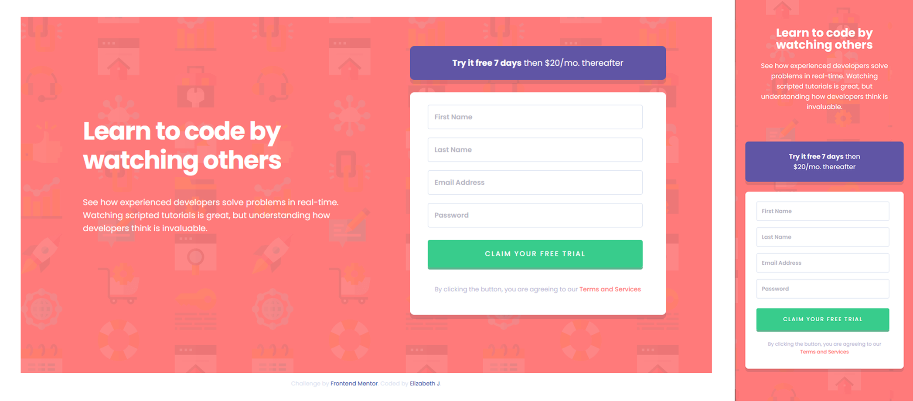
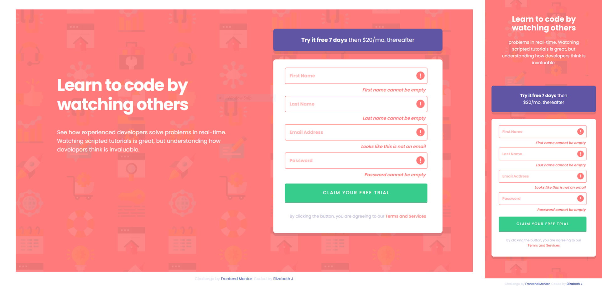

# design-challenges

# Frontend Mentor - 3-column preview card component solution

This is a solution to the [3-column preview card component challenge on Frontend Mentor](https://www.frontendmentor.io/challenges/3column-preview-card-component-pH92eAR2-). Frontend Mentor challenges help you improve your coding skills by building realistic projects. 

## Table of contents

- [Overview](#overview)
  - [The challenge](#the-challenge)
  - [Screenshot](#screenshot)
  - [Links](#links)
- [My process](#my-process)
  - [Built with](#built-with)
  - [Continued development](#continued-development)
- [Author](#author)

## Overview

### The challenge

Users should be able to:

- View the optimal layout for the site depending on their device's screen size
- See hover states for all interactive elements on the page
- Receive an error message when the `form` is submitted if:
  - Any `input` field is empty. The message for this error should say *"[Field Name] cannot be empty"*
  - The email address is not formatted correctly (i.e. a correct email address should have this structure: `name@host.tld`). The message for this error should say *"Looks like this is not an email"*

### Screenshot

### Links

- Live Site URL: [Live](https://eli-jones.github.io/design-challenges/intro-sign-up/signup-index.html)

## My process

### Built with

- Semantic HTML5 markup
- CSS custom properties
- Flexbox
- Media Queries
- Javascript

### Continued development

Something I struggled with was the JS validation. It has been a few months since I've really ever thought about JS, and while I review the Codecademy lesson on HTML Form Validation, it didn't really touch on the things I needed it to for this project. I've done my best and heavily referenced Programming's Fun video (https://www.youtube.com/watch?v=yag59U7ESRE) on this project. I tried a handful of ways to get the placeholder text for the email input field to change when the input is invalid,  but I wasn't able to get it work correctly. I think I'll come back to this after a bit more practice to try it again.

## Author

- Github - [@eli-jones](https://github.com/eli-jones)
- Frontend Mentor - [@eli-jones](https://www.frontendmentor.io/profile/eli-jones)
