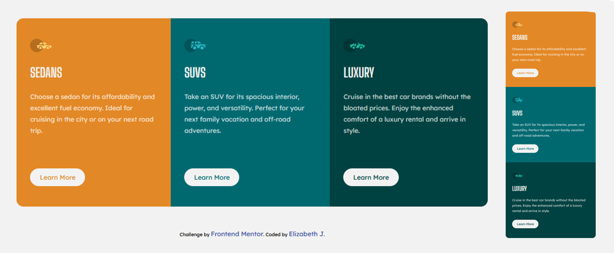

# design-challenges

# Frontend Mentor - 3-column preview card component solution

This is a solution to the [3-column preview card component challenge on Frontend Mentor](https://www.frontendmentor.io/challenges/3column-preview-card-component-pH92eAR2-). Frontend Mentor challenges help you improve your coding skills by building realistic projects. 

## Table of contents

- [Overview](#overview)
  - [The challenge](#the-challenge)
  - [Screenshot](#screenshot)
  - [Links](#links)
- [My process](#my-process)
  - [Built with](#built-with)
  - [Continued development](#continued-development)
- [Author](#author)

## Overview

### The challenge

Users should be able to:

- View the optimal layout depending on their device's screen size
- See hover states for interactive elements

### Screenshot

### Links

- Live Site URL: [Live](https://eli-jones.github.io/design-challenges/three-card/card-index.html)

## My process

### Built with

- Semantic HTML5 markup
- CSS custom properties
- Flexbox
- Media Queries

### Continued development

I took a break over the holidays from coding, so this was largely a refresher for my skills. The one thing I wish I could do better is that the Learn More buttons get a little taller when active. I tried a handful of different solutions on trying to get the border to display inside the shape instead of being adding to the exterior, but none of them worked, so I'll keep looking for a solution on that.

## Author

- Github - [@eli-jones](https://github.com/eli-jones)
- Frontend Mentor - [@eli-jones](https://www.frontendmentor.io/profile/eli-jones)
